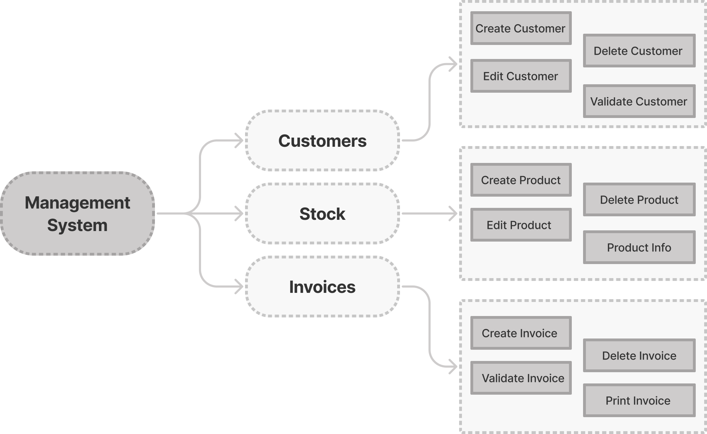

# How to structure a program

Created in 1972 to develop the UNIX operating system, C inherited UNIX's philosophy, like being case sensitive.

Other than that, UNIX had a wide range of commands and each one did only one task. If you needed to perform a more complex task, you only needed to chain commands to accomplish it.

Approaching problems this way is great! We all know from experience that when a complex problem rises, it is easier to break it apart into smaller and easy-to-solve problems.

## An example

When creating a computer program it should consist of a group of modules. These must be independent one from another. Each module should have its functions that perform only one task. This way, it will be easier to maintain the software and develop new features.

For example, this management system consists of 3 modules: Customers, Stock, and Invoices. As each module has its functions: Create Customer, Delete Product, Print Invoice, etc. Dividing a project into modules will help you avoid creating what we call "spaghetti code", which is hard to maintain (trust me, I've been there).

Despite all the warnings about spaghetti code, many developers neglect it, which causes their projects to fail over time. In the end, organizing a programming project requires a lot of planning, but it will be rewarding!

  
[[⬅️ BACK]](3-how-to-structure-a-program.md)
&nbsp;&nbsp;&nbsp;&nbsp;&nbsp;
[[📋 TABLE OF CONTENTS]](../README.md)
&nbsp;&nbsp;&nbsp;&nbsp;&nbsp;
[[NEXT ➡️]](4-the-programming-process.md)
