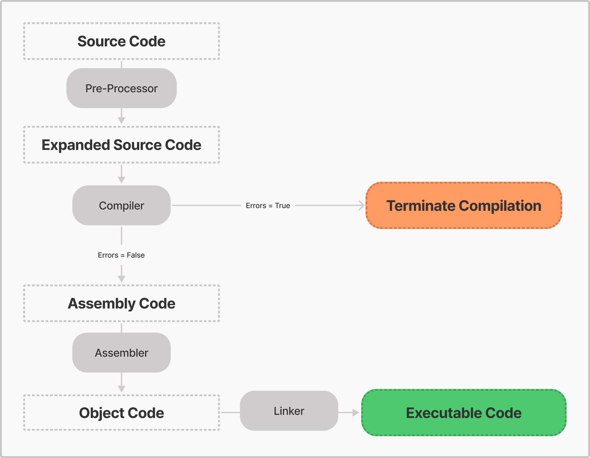

# Compilation cycle in C

As you probably know, a computer only understands 1's and 0's, but when writing C code you use symbols, characters, numbers. Take a look at this code example:

```c
#include <stdio.h>

int main(){
    printf("Hello C Language");
    return 0;
}
```

You can tell that this algorithm is written with English words, but our computer is incapable of understanding them. To execute the algorithm we need to convert this source code into binary code. That process is called **compilation**.


The compilation process can be divided into four sub-processes: pre-processing, compiling, assembling, and linking.

### 1. Pre-processing

The source code is written in a text editor such as Visual Studio Code and is given the extension ".c". After that, the code is passed to the pre-processor, a text substitution tool that instructs the compiler to do the required pre-processing before compiling.
<br><br>

> All pre-processor commands begin with a hash symbol (_#_).
>
> In the example above, the `include` directive tells the pre-processor to include the `stdio.h` library from System Libraries into the current source code file.

### 2. Compiling

Once pre-processed, the compiler checks if the code was well written, that is, if the instructions respect the language's syntax. If the compiler detects an error, the compilation process terminates, informing the programmer where that error is. The programmer needs to edit the source code to solve the error and re-compile the code.

The compiler also detects cases in where the code's syntax is correct but leads to some suspicion. So, instead of outputting an error message, the compiler outputs a warning message for each suspicious piece of code. Unlike errors, if warning messages show up the compilation process will continue.

So, when the code is free from errors, the compiler converts the pre-processed code into assembly code.

### 3. Assembling

Now, the assembler will convert the assembly code into object code and save it in a file with the same name of the source file but with the extension **.obj** in DOS-based systems or **.o** in UNIX-based systems.

> If the name source file is named "hello-world.c', then the object file would be 'hello.obj'.

### 4. Linking

The linker is a utility that links the various object files and library files, creating the executable file. The executable file has the same name as the source file but differs only in its extension: in DOS, the extension of the executable file is .exe, and in UNIX, it is .out.

## Example

```c
#include <stdio.h>

int main(){
    printf("Hello C Language");
    return 0;
}
```

Lets consider that this sample source code above was saved in a file called 'hello-lang.c'. That is what would happen if we would compile this source code:



## Summary

The compilation process can be divided into four sub-processes: pre-processing, compiling, assembling, and linking. The basic process for compiling a C program is:

- The pre-processor utility generates the C source to be compiled;
- The compiler compiles the C source into object code generating a set of object files;
- The linker links the various object files along with the required libraries, creating an executable file.

<br><br>
[[⬅️ BACK]](3-how-to-structure-a-program.md)
&nbsp;&nbsp;&nbsp;&nbsp;&nbsp;
[[📋 TABLE OF CONTENTS]](../README.md)
&nbsp;&nbsp;&nbsp;&nbsp;&nbsp;
[[NEXT ➡️]](../2-environment-setup-for-c/1-the-environment.md)
